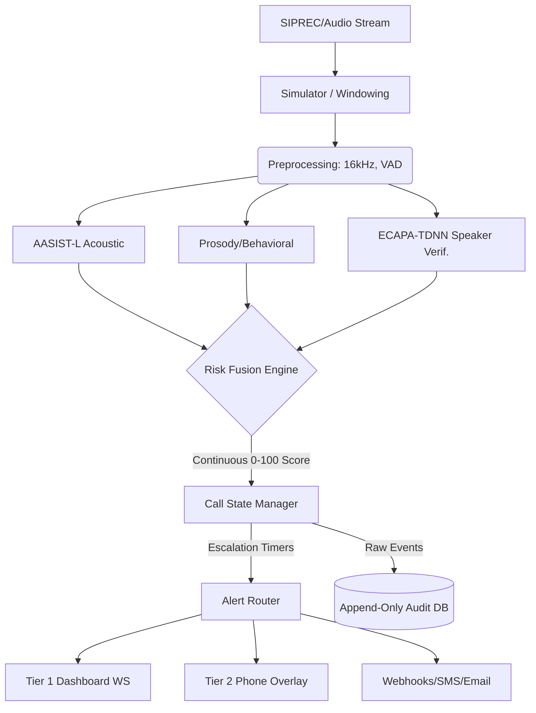

# TrueTone: Real-Time Voice-Clone Detection System

TrueTone is an AI-powered, real-time voice-clone detection pipeline designed to intercept deepfakes in live audio streams (like phone calls or virtual meetings) with ultra-low latency (<500ms). It fuses acoustic artifact detection (AASIST-L), behavioral/prosody anomaly scoring, and speaker verification (ECAPA-TDNN) into a single, explainable risk engine. 

The project is structured into two protection tiers: an Enterprise Dashboard (Tier 1) for call centers/SBCs, and a personal phone integration (Tier 2) leveraging Flash SMS and injected audio.

## Repository Structure

- `/truetone/`: The core application directory (contains the FastAPI backend and Next.js frontend).
- `/dataset/`: Contains dataset shards and JSON metadata for training/evaluation.
- `/docs/`: Project documentation and behavioral analysis logs.
- `/models/`: Fine-tuned models for various languages (e.g., Hindi, Tamil).
- `/reports/`: Automated evaluation and performance reports for the model pipeline.

---

## System Architecture



## Setup & Installation Instructions

To run the TrueTone application locally, you will need to set up both the backend and frontend components located in the `truetone` folder.

**Prerequisites:** 
- Python 3.10+
- Node.js 18+ (and `npm`)

### 1. Backend Setup (FastAPI)

The backend handles the AI models, risk fusion engine, and the WebSocket data pipeline.

```bash
cd truetone/backend

# Create a virtual environment
python -m venv venv

# Activate the virtual environment
# On Linux/macOS:
source venv/bin/activate
# On Windows:
# venv\Scripts\activate

# Install all required Python dependencies
pip install -r requirements.txt
```

### 2. Frontend Setup (Next.js)

The frontend provides the Enterprise Dashboard interface.

```bash
cd ../frontend

# Install all Node.js dependencies
npm install
```

## Running the Application

You can easily launch both the frontend and backend simultaneously using the provided startup script.

```bash
# Go to the application directory
cd truetone

# Start the system
./start_demo.sh
```

**To start with a clean slate (which clears the SQLite database):**
```bash
./start_demo.sh --reset
```

Once the script completes starting the services, navigate to `http://localhost:5000` in your web browser to access the TrueTone console. (The API backend runs on port 8000).

---

## What's Real vs. Simulated
For the purposes of this standalone demo, we are transparent about what is fully implemented versus what is simulated to run without complex proprietary infrastructure:

* **REAL:** 
  * Pretrained AASIST-L inference for synthetic speech detection.
  * Pretrained ECAPA-TDNN inference via SpeechBrain for 1:1 speaker verification.
  * The Risk Fusion logic, contextual weighting, and EMA smoothing.
  * WebSocket live data pipeline with reconnect backoff.
  * Append-only SQLModel audit log (read-only APIs).
  * Auto-escalation timers using `asyncio` task queues.
* **RULE-BASED PLACEHOLDER:** 
  * Prosody/Behavioral scoring. The feature extraction (pitch, jitter, shimmer) is real via Parselmouth/Librosa, but the LightGBM model currently uses a rule-based heuristic.
* **SIMULATED:** 
  * Live telecom SIPREC/IMS ingestion (we use an async generator streaming rolling `.wav` chunks).
  * Telecom SMSC Flash SMS network delivery (we render the exact UX payload on the frontend mockup).
  * Webhook/Email APIs (payloads are built and logged, but actual `POST` requests to 3rd party providers are bypassed to avoid API key limits).

## Known Limitations
* AASIST-L is trained on ASVspoof 2019 (primarily 16kHz LA data). It may show accuracy degradation on heavily compressed 8kHz telephony data or out-of-domain modern TTS models without fine-tuning.
* Call state is managed in-memory on the backend for demo simplicity. A production environment would require a durable K/V store like Redis.
