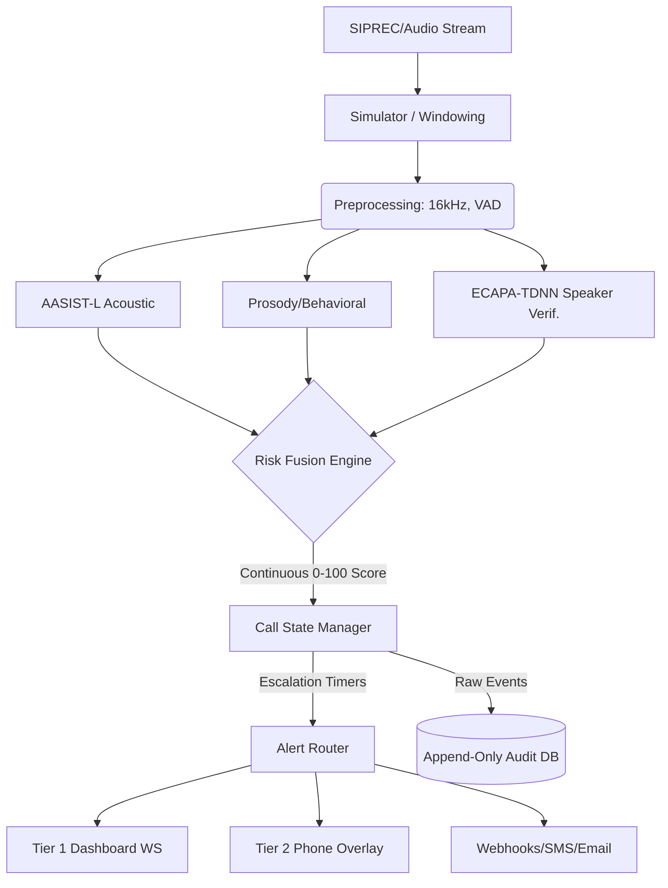

# TrueTone: Real-Time Voice-Clone Detection

TrueTone is an AI-powered, real-time voice-clone detection pipeline designed to intercept deepfakes in live audio streams (like phone calls or virtual meetings) with ultra-low latency (<500ms). It fuses acoustic artifact detection (AASIST-L), behavioral/prosody anomaly scoring, and speaker verification (ECAPA-TDNN) into a single, explainable risk engine. It is split into two protection tiers: an Enterprise Dashboard (Tier 1) for call centers/SBCs, and a personal phone integration (Tier 2) leveraging Flash SMS and injected audio.

## Architecture Pipeline



## What's Real vs. Simulated
For the purposes of this standalone demo, we are transparent about what is fully implemented versus what is simulated to run without complex proprietary infrastructure:

* **REAL:** 
  * Pretrained AASIST-L inference for synthetic speech detection.
  * Pretrained ECAPA-TDNN inference via SpeechBrain for 1:1 speaker verification.
  * The Risk Fusion logic, contextual weighting, and EMA smoothing.
  * WebSocket live data pipeline with reconnect backoff.
  * Append-only SQLModel audit log (read-only APIs).
  * Auto-escalation timers using `asyncio` task queues.
* **RULE-BASED PLACEHOLDER:** 
  * Prosody/Behavioral scoring. The feature extraction (pitch, jitter, shimmer) is real via Parselmouth/Librosa, but the LightGBM model is pending labeled ASVspoof/bootstrap training data (see `TODO.md`), so it currently uses a rule-based heuristic.
* **SIMULATED:** 
  * Live telecom SIPREC/IMS ingestion (we use an async generator streaming rolling `.wav` chunks).
  * Telecom SMSC Flash SMS network delivery (we render the exact UX payload on the frontend mockup).
  * Webhook/Email APIs (payloads are built and logged, but actual `POST` requests to 3rd party providers are bypassed to avoid API key limits).

## Known Limitations
* AASIST-L is trained on ASVspoof 2019 (primarily 16kHz LA data). It may show accuracy degradation on heavily compressed 8kHz telephony data or out-of-domain modern TTS models without fine-tuning.
* Call state is managed in-memory on the backend for demo simplicity (using `Dict[str, CallRiskState]`). A production environment would require a durable K/V store like Redis.

## Setup Instructions

**Prerequisites:** 
- Python 3.10+
- Node.js 18+ (npm)

```bash
# 1. Setup Backend
cd backend
python -m venv venv
source venv/bin/activate
pip install -r requirements.txt

# 2. Setup Frontend
cd ../frontend
npm install
```

## Running the Demo

We have included a single startup script that launches both the FastAPI backend and Next.js frontend concurrently. 

```bash
# Start the system
./start_demo.sh

# Start with a clean slate (clears the SQLite database)
./start_demo.sh --reset
```

Once running, navigate to `http://localhost:5000` to access the console. See `DEMO_SCRIPT.md` for a guided presentation path.
